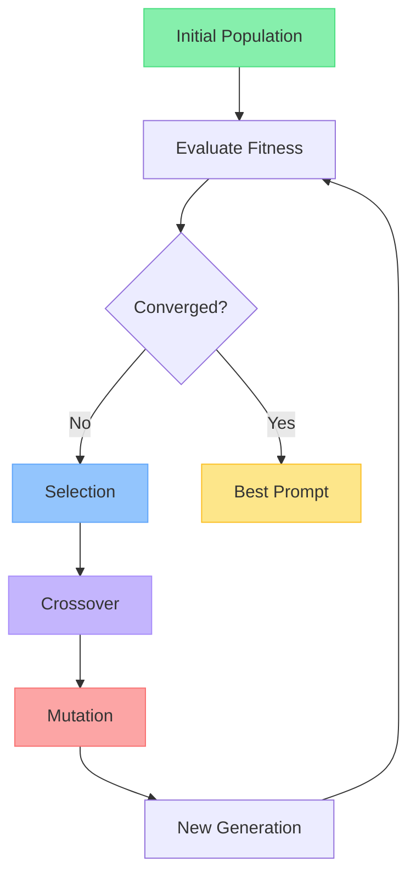
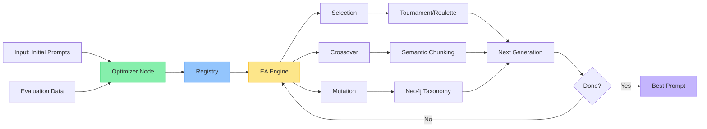
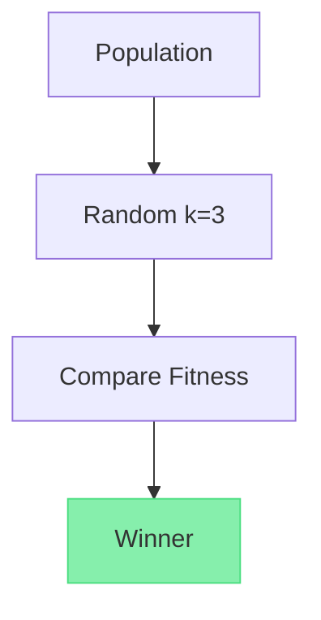
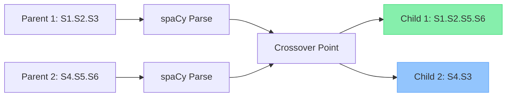
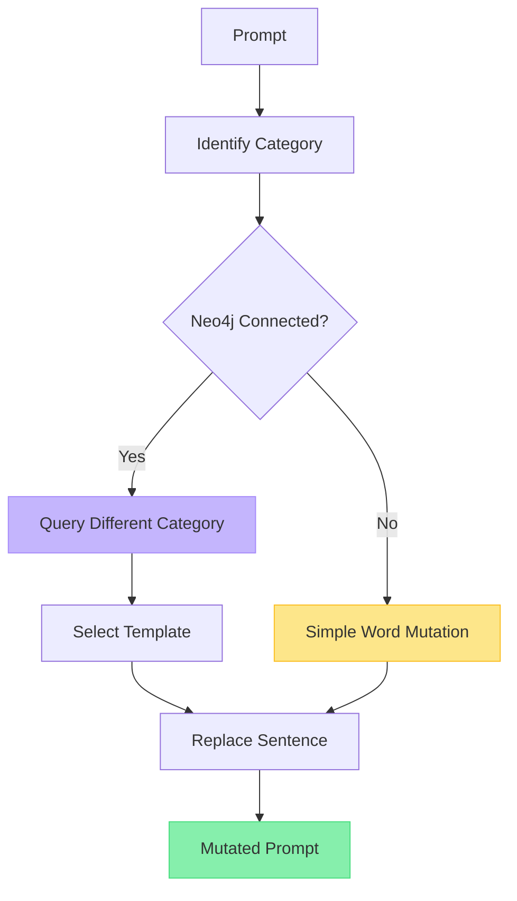
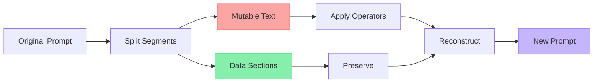
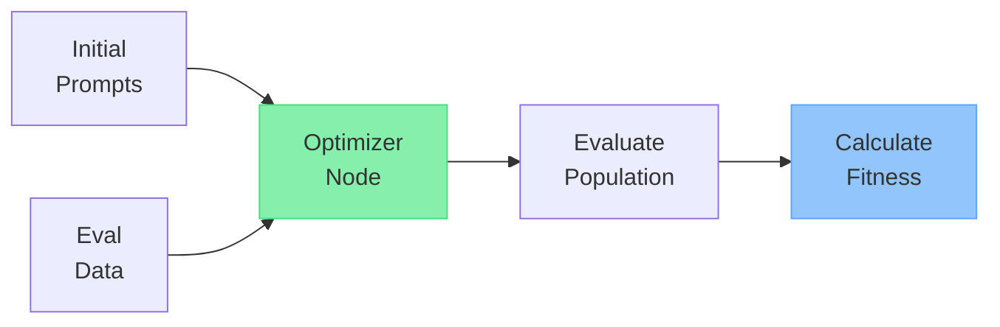
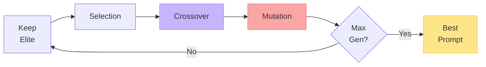

# Prompt Evolution Lab

#### Towards Systematic Prompt Optimisation for Real Tasks

<div class="pt-12">
  <span class="text-xl">
    Gauransh Kumar & Vennila Sooben
  </span>
  <br />
  <span class="text-gray-400">IFT 6076</span>
</div>

---
layout: center
---

# The Challenge

<v-clicks>

- Manual prompt engineering is **time-consuming**
- Trial-and-error lacks **systematic approach**
- Hard to optimize for **real classification tasks**

</v-clicks>

<div v-click class="text-center mt-8 text-2xl font-semibold text-emerald-400 opacity-90">
Solution: Evolutionary Algorithms
</div>

---
layout: two-cols
---

# Evolutionary Algorithms

<v-clicks>

- Inspired by **natural selection**
- Population-based optimization
- Iterative improvement
- Genetic operators

</v-clicks>

::right::



---
layout: center
---

# System Architecture



---

# Selection Operators

<div class="grid grid-cols-2 gap-8">

<div v-click>

## Tournament Selection

- Select k random individuals
- Choose best among them
- Higher selection pressure
- **Default method**

</div>
<div v-click>



</div>

</div>

---

# Novel Feature: Semantic Crossover

<v-clicks>

- Uses **spaCy NLP** for sentence detection
- Sentence-level recombination
- Preserves semantic meaning
- Fallback: period-based splitting

</v-clicks>



<div v-click class="text-center mt-4 text-sm text-gray-400">
Semantic chunks ensure coherent offspring prompts
</div>

---

# Novel Feature: Taxonomy-Based Mutation

<div class="grid grid-cols-2 gap-4">

<div>

<v-clicks>

- Connects to **Neo4j/Memgraph**
- Pattern taxonomy database
- Cross-category mutations
- Ensures diversity

</v-clicks>

<div v-click class="mt-4 text-xs">

**Graph Schema:**
```
(Pattern {label: "text"})
  ↓ BELONGS_TO
(SubCategory {name: "X"})
  ↓ BELONGS_TO
(Category {name: "Y"})
```

</div>

</div>

<div>



</div>

</div>

---

# Novel Feature: Data Preservation

<v-clicks>

- Protects examples during evolution
- Detects **`[DATA]...[/DATA]`** tags
- Preserves code blocks **` ```...``` `**
- Keeps example lines intact

</v-clicks>

<div v-click class="mt-8">



</div>

<div v-click class="text-center mt-4 text-sm text-gray-400">
Only instructions evolve, examples stay constant
</div>

---

# Fitness Metrics

<div class="grid grid-cols-2 gap-8 mt-8">

<div v-click>

## Matthews Correlation Coefficient

- Range: **[-1, 1]**
- Handles imbalanced classes
- **Default metric**
- Robust for binary/multiclass

$$
MCC = \frac{TP \times TN - FP \times FN}{\sqrt{(TP+FP)(TP+FN)(TN+FP)(TN+FN)}}
$$

</div>

<div v-click>

## Balanced Accuracy

- Average of per-class recall
- Range: **[0, 1]**
- Alternative metric
- Intuitive interpretation

$$
BA = \frac{1}{C}\sum_{i=1}^{C} \frac{TP_i}{TP_i + FN_i}
$$

</div>

</div>

<div v-click class="text-center mt-8 text-lg text-slate-400">
Both metrics ensure fair evaluation across imbalanced datasets
</div>

---

# Complete Workflow

<div class="grid grid-rows-2 gap-8">

<div>

## Input & Evaluation


</div>

<div>

## Evolution Loop



</div>

</div>

---
layout: center
class: text-center
---

# Key Innovations

<v-clicks>

<div class="text-3xl mb-4">🧬 Semantic sentence-level crossover</div>

<div class="text-3xl mb-4">🗄️ Taxonomy-driven mutation with Neo4j</div>

<div class="text-3xl mb-4">🛡️ Intelligent data preservation</div>

<div class="text-3xl mb-4">📊 Robust fitness metrics for real tasks</div>

</v-clicks>

---
layout: center
class: text-center
---

# Thank You

## Questions?

<div class="mt-12">
  <div class="text-xl">Gauransh Kumar & Vennila Sooben</div>
  <div class="mt-4 text-gray-400">Prompt Evolution Lab</div>
</div>
